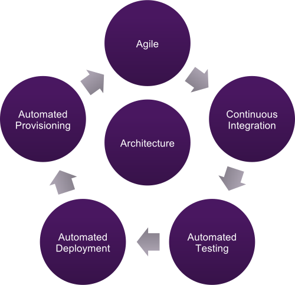

<!-- .slide: data-background="#64217E" -->

# What is Continuous Delivery?

!SUB
# Definition

“The software can be **deployed** and **executed** through its lifecycle so users can get
**fast**, **automated feedback** and **experiment** so to assess the **readiness** of the system”

!SUB
# Why Continuous Delivery?

**Key Reasons**
- Make release painless <!-- .element: class="fragment" -->
- Reduce time to market <!-- .element: class="fragment" -->
- Increase software quality and stability <!-- .element: class="fragment" -->
- Reduce ongoing costs <!-- .element: class="fragment" -->
- Increase employee and customer satisfaction  <!-- .element: class="fragment" -->

!NOTE
- painless: release should be boring. By the push of a button deploy to production
- t2m: release with low risk faster
- quality: by using test automation
- costs:  investing upfront in automation make its cheaper to make changes to systems
- satisfaction: deliver features that the customers and employees getting satisfaction,
customer feedback faster which leeds. This is a really rewarding experience. This crreates faster feedback loops

!SUB
# Continuous Delivery

**Principles**

- Build quality in <!-- .element: class="fragment" -->
- Work in small batches <!-- .element: class="fragment" -->
- Automate all the things <!-- .element: class="fragment" -->
- Continuous improvement <!-- .element: class="fragment" -->
- Everyone is responsible <!-- .element: class="fragment" -->

!NOTE
Defects are always fixed and non functionals are tackled
quality is not owned by testers

!SUB
# Continuous Delivery

**Ingredients**

 <!-- .element: style="width: 50%; height: auto;" class="noborder" -->

!NOTE
Config management: provision servers
Agile: xp Principles, work and deliver small increments
Build: continuous integration/build and validate code
Testing: testers are not responsible for quality. Testers and developers need to work together to build quality in.

!SUB
# Continuous Delivery

**Pipeline**

 <!-- .element:    class="noborder" -->

!NOTE
1 code changes
2 trigger a build
3 run tests, gives feedback (unit tests)
4 deploy
5 run acceptance tests
6 run non functionals tests or et
7 deploy to stage or production
