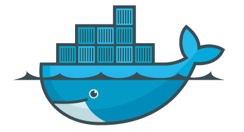

<!-- .slide: data-background="#64217E" -->

#Why is Docker
 <!-- .element: class="noborder" -->

# a good fit for Continuous Delivery?

!SUB
## Faster
- Slow one-time events happen only once on _image_ creation, not on _instance_ creation
- Creating instances is fast/cheap

!NOTE
One-time example initialisation of the app has to happen just once. Fort example for test and production, same artifact is started which had it's initialization done @ build time

!SUB
## Better
- Same image used for development and production
- Same image can be run locally
- Portable/host-independent
- Consistent and reproducible results
- Isolated
- Easy to scale horizontally

!SUB
## And more
- Encourages collaboration between Dev and Ops
- Version control how you build your images
- Share your images using the Docker Hub
