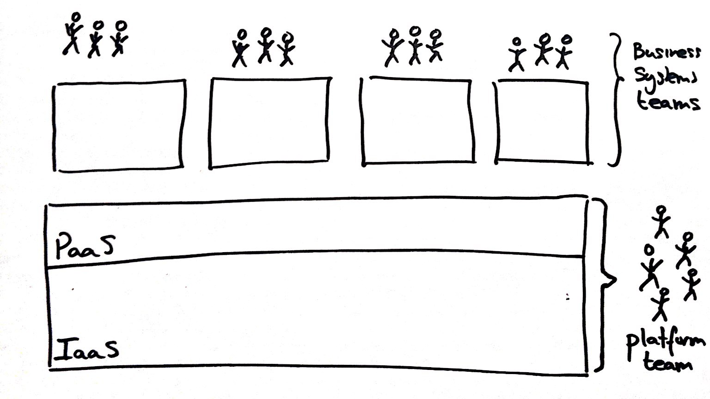
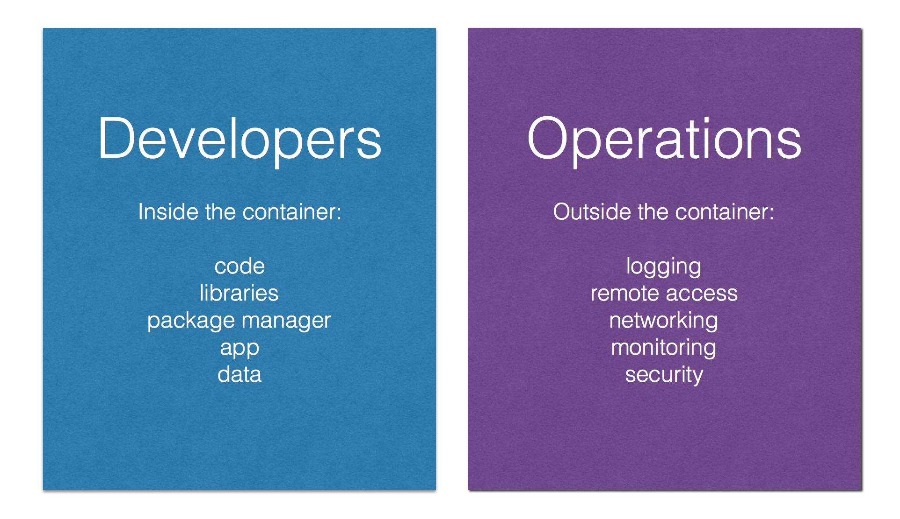
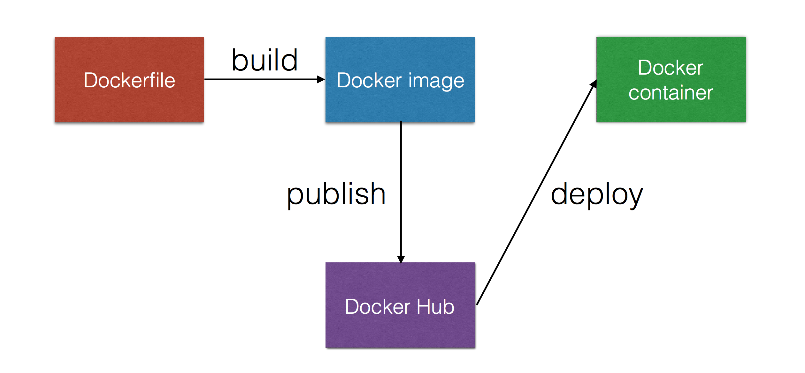

<!-- .slide: data-background="#64217E" -->

# What is Docker?
 <!-- .element: class="noborder" -->

!SUB
## What is Docker?

> Docker is the world's leading&nbsp; software containerization platform

_[docker.com](https://www.docker.com)_

!SUB
## But what is it really?

- Process running in isolation (filesystem, resources, networking, user)
- Images you can share/reuse
- Simple DSL to describe how to build images
- Artifact store to share images

!NOTE
You get all the goodies of virtual machine per appliance, but without the cost.

Filesystem isolation
Resource isolation
Network isolation
And it is fast!

!SUB
# Docker has taken the world by Storm!

- 400.000.000 downloads
- 300.000+ Dockerized applications
- 50.000+ third party projects on Github
- 150.000.000 dollar in funding

!SUB
# Why? It Supports True DevOps!
 

!SUB
# Separation of Concerns
 

!SUB
## Basic Components
 

