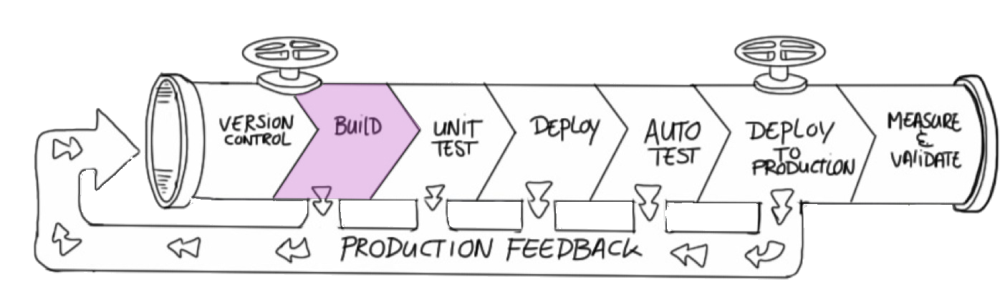
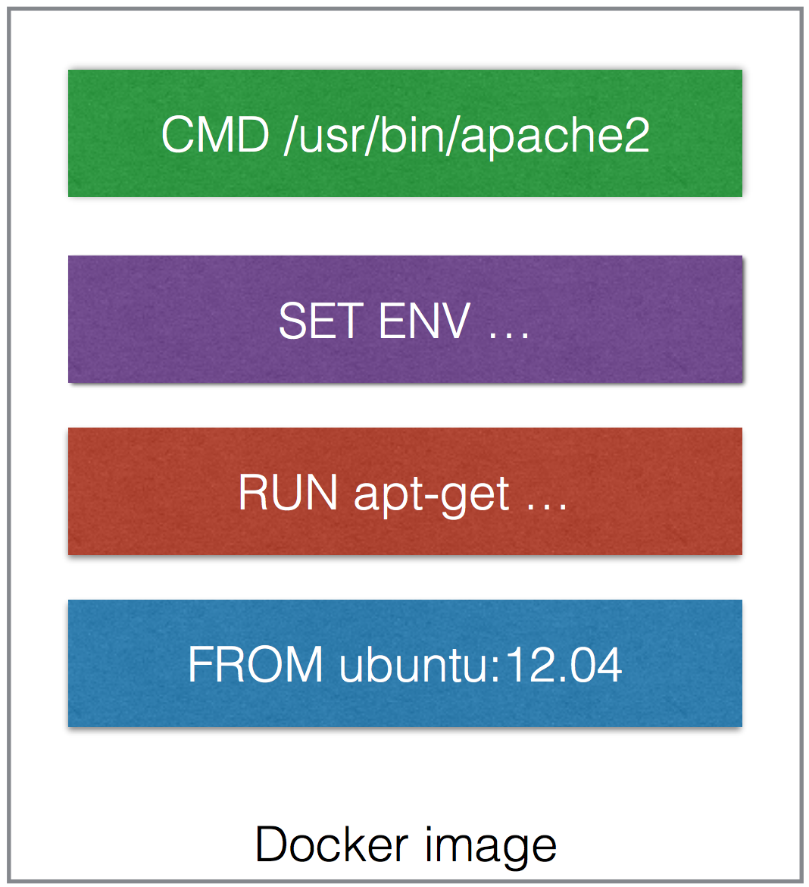

<!-- .slide: data-background="#64217E" -->

# Build
 <!-- .element: class="noborder" -->

!SUB
## Build workflow
- Get the application sources <!-- .element: class="fragment" -->
- Build the application/artifact <!-- .element: class="fragment" --> -> The Docker image is the artifact

!SUB
## Docker Images

- Contain everything needed to run the app
- Are portable across daemons
- Are created using a simple DSL
- Can be shared by pushing them to an artifact store
