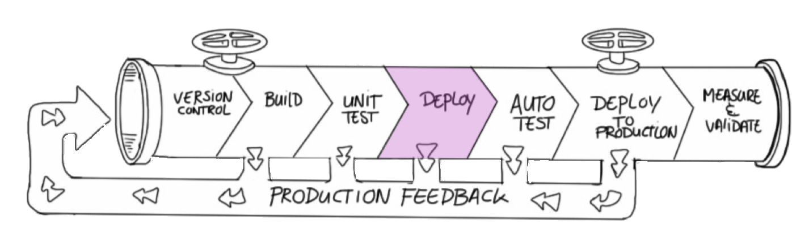
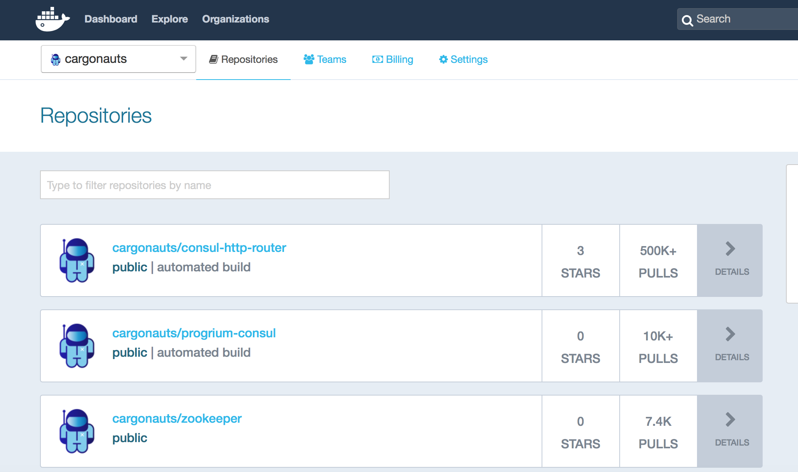

<!-- .slide: data-background="#64217E" -->

# Deploy

 <!-- .element: class="noborder" -->

!SUB
# Deployment workflow
- Store the build artifact in an artifact store <!-- .element: class="fragment" -->
- Get the build artifact from the artifact store and run it where we want it to run <!-- .element: class="fragment" -->

!SUB
## Docker hub

- Docker's own (public) artifact store
- Contains Docker images
  - Official/upstream images
  - Your own images
- Images can be private
- Can automatically build `Dockerfile`s
