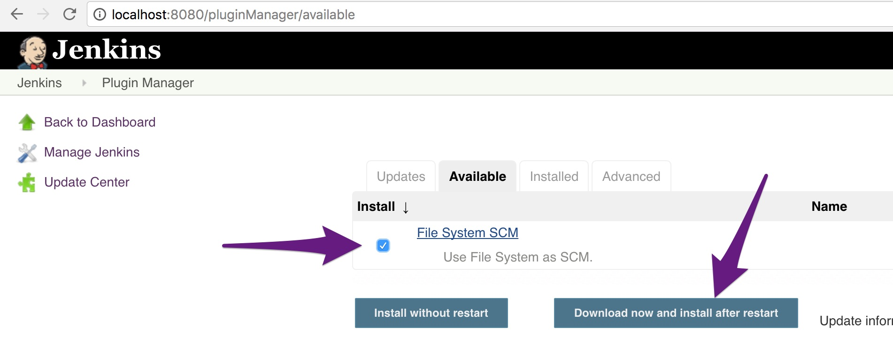
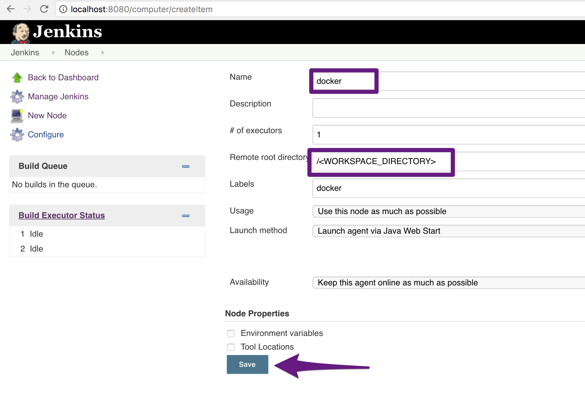

<!-- .slide: data-background="#64217E" -->
<center>
#  <!-- .element: style="width: 10%; height: auto;" class="noborder" --> Exercise: Build a Pipeline in Jenkins

!SUB
# Pipeline In Jenkins

**Start Jenkins**

```bash
# Create directory where Jenkins store static files
$ mkdir $HOME/jenkins

# Start Jenkins
$ docker run -d --name=jenkins -p 8080:8080 -p 50000:50000 -v $HOME/jenkins:/var/jenkins_home -v $HOME/twc-cd-with-docker:/twc-cd-with-docker --env JAVA_OPTS="-Xmx2024m" jenkins
```

!SUB
# Configure Jenkins: Welcome

Grab **initial admin password** and open url **http://localhost:8080** and authenticate with Jenkins

```bash
$ cat $HOME/jenkins/secrets/initialAdminPassword
680595e443024995ad6fa4d1ee5baa9a
```

Then **Install suggested plugins**

!SUB
# Configure Jenkins: Install extra plugin

Go to **Manage Jenkins > Manage Plugins** and install plugins

 <!-- .element: style="width: 60%; height: auto;" class="noborder" -->

!SUB
# Configure Jenkins: Docker build node

Click on **Build Executor Status** and then on **new node** and add a build node **docker**

 <!-- .element: style="width: 50%; height: auto;" class="noborder" -->   

Goto docker build node  and copy **secret**. You need it in the next slide.

!SUB
# Configure Jenkins: Start build node

Start build **node**
```bash
$ nohup java -jar scripts/slave.jar -secret [BUILD_NODE_SECRET] -jnlpUrl http://localhost:8080/computer/docker/slave-agent.jnlp >/dev/null 2>&1 &
```

!SUB
# Create build job in Jenkins

On the welcome screen in Jenkins goto **create new jobs**. Give the job a **name** and choose a **freestyle project**. Now **configure:**

- Restrict where this project can be run
 - label expression: **docker**
- Source code management
 - Use **File System**
 - Path: /< DIRECTORY_TO_REPOSITORY_FILES >/twc-cd-with-docker
- Build
 - Choose "add build step" type "execute shell"
 - Command: **./deploy/deploy.sh**
- Save and build

!SUB
# Check

**What have we done thus far?**
- Automatically deployed the application  <!-- .element: class="fragment" -->

**What can we improve?** <!-- .element: class="fragment" -->
- Extra: Trigger build automatically  <!-- .element: class="fragment" -->
 - Login or signup for github or gitlab
 - Push you code to repository
 - Change and push a code change
 - Trigger the build on code changes
