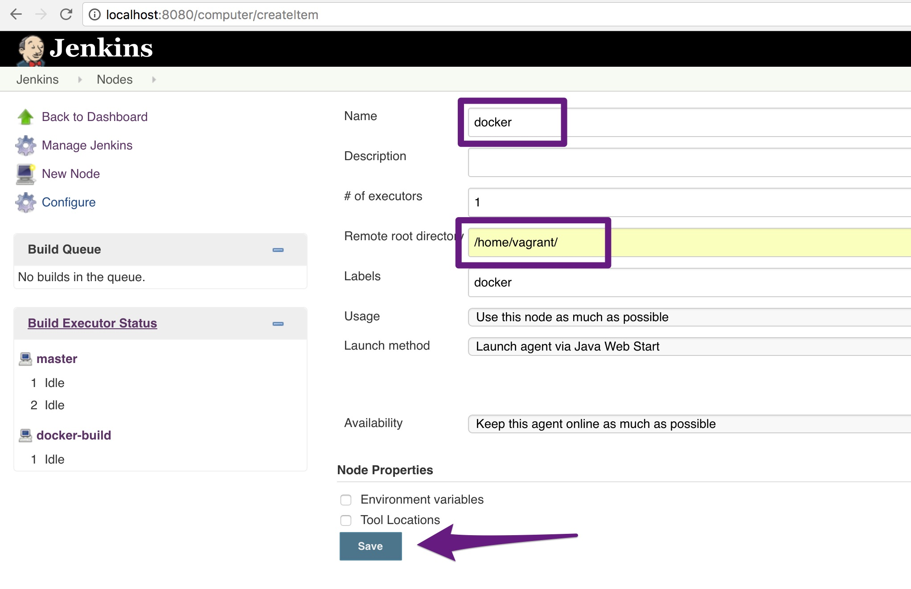

<!-- .slide: data-background="#64217E" -->
<center>
#  <!-- .element: style="width: 10%; height: auto;" class="noborder" --> Exercise: Build a Pipeline in Jenkins

!SUB
# Pipeline In Jenkins

**Start Jenkins**

```bash
# Create directory where Jenkins store static files
$ mkdir $HOME/jenkins
# Start Jenkins
$ docker run -d --name=jenkins -p 8080:8080 -p 50000:50000 -v $HOME/jenkins:/var/jenkins_home --env JAVA_OPTS="-Xmx2024m" jenkins
```

!SUB
# Configure Jenkins: Welcome

Grab **initial admin password** and authenticate with Jenkins

```bash
$ cat $HOME/jenkins/secrets/initialAdminPassword
680595e443024995ad6fa4d1ee5baa9a
```

And **Install suggested plugins**

!SUB
# Configure Jenkins: Install extra plugin

Go to **Manage Jenkins > Manage Plugins** and install plugins

 <!-- .element: style="width: 60%; height: auto;" class="noborder" -->

!SUB
# Configure Jenkins: Authorization

Add **ssh-key** contents to Jenkins **Global credentials**

 <!-- .element: style="width: 60%; height: auto;" class="noborder" -->   

!SUB
# Configure Jenkins: Docker build node

Click on **Build Executor Status** and on **new node** and give it a name. Create **docker** node

 <!-- .element: style="width: 60%; height: auto;" class="noborder" -->   

!SUB
# Configure Jenkins: Start build node

Start build **node**
```bash
$ wget http://localhost:8080/jnlpJars/slave.jar
$ java -jar slave.jar -jnlpUrl http://localhost:8080/computer/docker/slave-agent.jnlp -secret [GRAB_SECRET_FROM_SCREEN]
```

!SUB
# Create build job in Jenkins

On the welcome screen in Jenkins goto **create new jobs** named **deploy-production** and choose a **freestyle project**

- Source code management
 - twc-cd-with-docker
- Build
 - Choose "add build step" type "execute shell"
 - Command: **./deploy/deploy.sh**
- save and run
