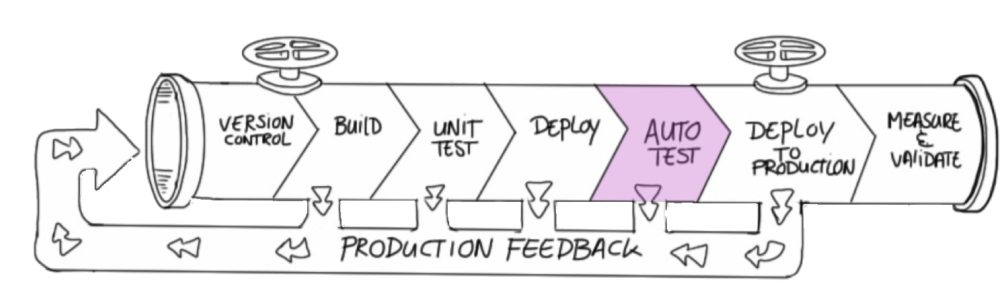

<!-- .slide: data-background="#64217E" -->
<center>
# Test
 <!-- .element: class="noborder" -->

!SUB
# Tests with Docker
- Run tests from tester container</span> <!-- .element: class="fragment" -->
- Artifact container is the System Under Test <!-- .element: class="fragment" -->

!SUB
# Dockerfile tester Docker image

**tester/Dockerfile**

```dockerfile
FROM alpine

RUN apk add --no-cache curl

ADD test.sh /test.sh

RUN chmod +x /test.sh

ENTRYPOINT ["/test.sh"]
```

!SUB
# Build tester Docker image

```bash
docker build -t tester tester
```

!SUB
# Run tests

First start **system under test** and run **test**

```bash
# Start SUT
docker run -d --name hello-world -p 8888:5000 python-hello-world:3

# Get ip of running container
SUT_IP=$(docker inspect --format '{{ .NetworkSettings.IPAddress }}' hello-world)

# Run test
docker run tester "$SUT_IP:8888"
```

!SUB
# Check

**What have we done thus far?**
- The test fails :(** <!-- .element: class="fragment" -->
- Make the test pass!  <!-- .element: class="fragment" -->

**What can we improve?** <!-- .element: class="fragment" -->
- Extra: Add test step in deploy job  <!-- .element: class="fragment" -->
