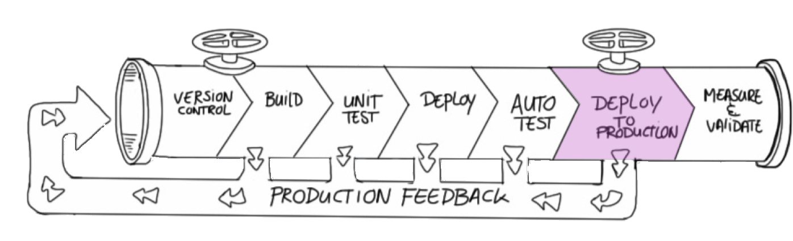

 <!-- .slide: data-background="#64217E" -->

# Deploy to Production
 <!-- .element: class="noborder" -->

!SUB
# Exercise: Deploy to production with confidence

**Remember** the pipeline? Change, Build, Deploy, Test, Deploy. Complete the pipeline

- Hints
 - Jenkins job dsl <!-- .element: class="fragment" -->
 - Jenkins pipeline
 - Gitlab CI
 
